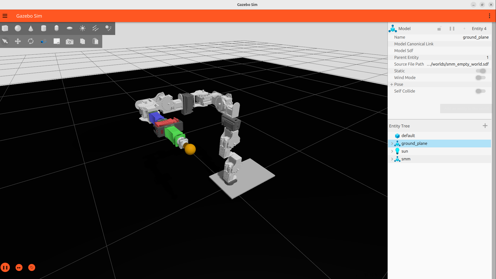

# SMM Gazebo Simulation (smm_gazebo_sim)


Core pkg for Gazebo simulation for Serial Metamorphic Manipulators (SMM) in ROS2. Gazebo Ionic.

## Overview

This package provides the simulation pipeline for the Serial Metamorphic Manipulator (SMM) in Gazebo Sim using `ros2_control`. It is designed to work in direct cooperation with the `smm_synthesis` package.

## Features

- Automatic generation of robot structure and parameters
- Dynamic (runtime) configuration of controllers based on the synthesized anatomy
- Spawn and control the robot in Gazebo Sim

## Important Notice

This package does not generate robot structure itself — it consumes the outputs of `smm_synthesis`. 

## Pipeline Overview

Currently the simulation pipeline is composed of two sequential launch stages:

- [1] smm_synthesis (structure + data generation)
- [2] smm_gazebo_sim (simulation + control)

### Structure synthesis (smm_sythesis)

```text
ros2 launch smm_synthesis master_synthesis_ndof.launch.py \
  data_dir:=~/ros2_ws/src/smm_class_pkgs/smm_data/synthesis/yaml \
  xacro_path:=~/ros2_ws/src/smm_class_pkgs/smm_synthesis/urdf/6dof/smm_structure_anatomy_assembly_6dof.xacro
```

All files are generated and stored in:

```text
~/ros2_ws/src/smm_class_pkgs/smm_data/synthesis/yaml/
```

Generated files from `master_synthesis_ndof`:

```text
assembly.yaml                → active structure parameters
gsai0.yaml                   → active joint frames
gsli0.yaml                   → link CoM frames
Mscomi0.yaml                 → spatial inertia matrices
gst0.yaml                    → TCP transform
xi_ai_anat.yaml              → active twists
gspj0.yaml                   → passive joint frames
xi_pj_anat.yaml              → passive twists
q_pj_anat.yaml               → pseudo joint angles
active_joint_names.yaml      → ACTIVE ros2_control joint list  ← CRITICAL
```

### Simulation and Control (smm_gazebo_sim)

```text
ros2 launch smm_gazebo_sim spawn_smm_gazebo_control.launch.py \
  controller_type:=position
  ```
- This launch file reads: `active_joint_names.yaml` and defines at runtime the exact controllable joints for the current robot anatomy.

- Executes the generator scripts that produce all control-essential config/plugin(xacro) files:

```text
generated_gz_ros2_control.xacro
generated_smm_controllers.yaml
```

- Builds robot_description. This dynamically inserts `gz_ros2_control system plugin`, hardware interfaces, joint interfaces.

```text
use_gz_ros2_control := true
gz_ros2_control_xacro := generated file
```

- Starts Gazebo Sim, spawns robot and starts ros2_control.

- Supported controller types (to be updated):

```text
controller_type:=position
controller_type:=velocity
controller_type:=effort
```

## How to implement for 3-6 DoF cases

### 3dof:

```text
ros2 launch smm_synthesis master_synthesis_ndof.launch.py \
  data_dir:=~/ros2_ws/src/smm_class_pkgs/smm_data/synthesis/yaml \
  xacro_path:=~/ros2_ws/src/smm_class_pkgs/smm_synthesis/urdf/3dof/smm_structure_anatomy_assembly_3dof.xacro

ros2 launch smm_gazebo_sim spawn_smm_gazebo_control.launch.py \
  xacro_path:=~/ros2_ws/src/smm_class_pkgs/smm_synthesis/urdf/3dof/smm_structure_anatomy_assembly_3dof.xacro \
  controller_type:=position
```

### 6dof:

```text
ros2 launch smm_synthesis master_synthesis_ndof.launch.py \
  data_dir:=~/ros2_ws/src/smm_class_pkgs/smm_data/synthesis/yaml \
  xacro_path:=~/ros2_ws/src/smm_class_pkgs/smm_synthesis/urdf/6dof/smm_structure_anatomy_assembly_6dof.xacro

ros2 launch smm_gazebo_sim spawn_smm_gazebo_control.launch.py \
  controller_type:=position
```

## Current status

- Dynamic structure synthesis
- Automatic joint extraction
- Runtime controller generation
- Gazebo Sim integration
- ros2_control integration
- Stable position control

## Gazebo Simulator



- Simple spawn with position controllers.

## License

This project is licensed under the BSD 3-Clause License. See the [LICENSE](LICENSE) file for details.
